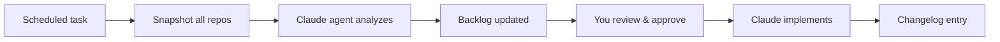
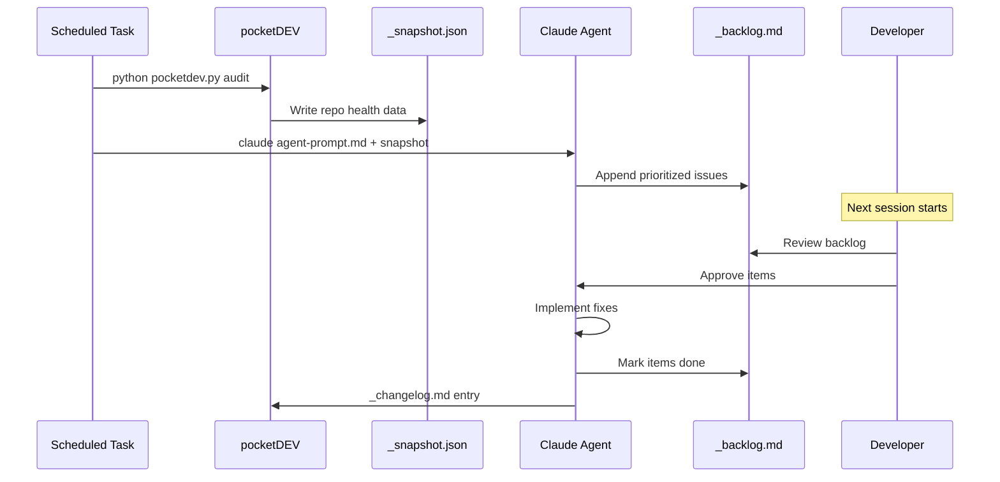
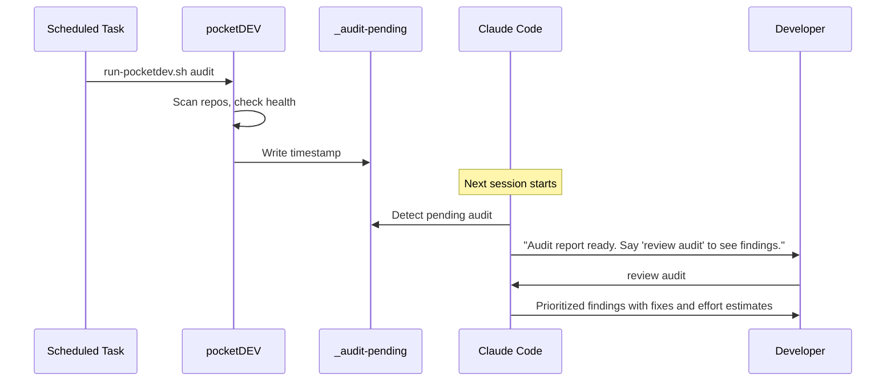

<div align="center">

# pocketDEV

**Claude-powered senior developer that maintains your tool portfolio.**

Auto-discovers git repos. Takes daily snapshots. Proposes fixes ranked by blast radius. You approve, it ships.


</div>

---

## How It Works

pocketDEV runs daily as a scheduled task. It snapshots every git repo on your machine, feeds the data to a Claude agent, and produces a prioritized backlog of issues and improvements. You review the backlog, approve what matters, and Claude implements the fixes.



---

## Daily Run Workflow

The core loop that keeps your portfolio healthy:



1. **Snapshot** -- The scheduled task runs `pocketdev.py audit`, which scans all repos and writes `_snapshot.json` with current health data.
2. **Analysis** -- A Claude agent reads the snapshot via `agent-prompt.md` and identifies new issues, regressions, and improvement opportunities.
3. **Backlog** -- New findings are appended to `_backlog.md`, prioritized by blast radius (security > correctness > maintainability > style).
4. **Approval** -- You review the backlog at session start. Nothing ships without your sign-off.
5. **Implementation** -- Approved items are implemented, committed, and logged in `_changelog.md`.

---

## Quick Start

```bash
git clone https://github.com/ionutrosu/claude-tool-auditor.git
cd claude-tool-auditor
python pocketdev.py audit
```

No dependencies to install. Python standard library only.

---

## Four Modes

### `agent` -- Automated daily maintenance (primary)

The agent mode is the main workflow. A scheduled task runs the snapshot, then a Claude agent analyzes the results and maintains the backlog. This is how pocketDEV operates day-to-day.

### `audit` -- Health scan across all repos

Scans every discovered repo for structural and hygiene problems. Produces `_snapshot.json` for agent consumption.

```bash
python pocketdev.py audit                      # All repos
python pocketdev.py audit --tool "Finance"     # One repo
python pocketdev.py --scan-dir ~/Projects audit # Custom directory
```

### `review` -- Deep code quality dive into one repo

Inspects a single codebase for complexity hotspots, code smells, security risks, dependency health, and test coverage.

```bash
python pocketdev.py review "Finance"
```

### `diagnose` -- Triage when something is broken

Gathers evidence before guessing: recent commits, test output, dependency state, error logs, environment checks.

```bash
python pocketdev.py diagnose "Transcriptor"
```

---

## What It Checks

### Audit Mode

| Check | What it catches |
|---|---|
| Missing `.gitignore` | Repos at risk of committing build artifacts, secrets, or junk |
| Tracked `node_modules/` | Bloated repos with vendored dependencies in git |
| Large files (>5MB) | Binaries, media, or data files that should use LFS or be gitignored |
| Missing README | Repos with no documentation at all |
| Stale repos | No changes in 30+ days |
| No git remote | Local-only repos with no backup |
| Uncommitted changes | Work sitting in the working tree |
| Unpushed commits | Commits that haven't reached the remote |
| Test detection | Whether tests exist and what framework they use |

### Review Mode

| Check | What it catches |
|---|---|
| Complexity hotspots | Files and functions that are too large (>60 lines per function) |
| TODOs / FIXMEs | Deferred work items with file and line references |
| Hardcoded secrets | API keys, tokens, passwords via pattern matching |
| Console log spam | Leftover `console.log` / `console.debug` calls |
| Commented-out code | Dead code blocks left behind |
| Dependency health | Outdated packages, missing lock files |
| Test coverage ratio | Test files vs. source files |
| Git activity | Commit frequency and contributor breakdown |

### Diagnose Mode

| Check | What it gathers |
|---|---|
| Recent commits | Last 20 commits and diff stats |
| Working tree state | Uncommitted changes that may be causing issues |
| Test execution | Actually runs the test suite and captures output |
| Dependency integrity | Checks if installed deps match declared deps |
| Error logs | Tails recent log files for clues |
| Environment | Missing `.env` files when `.env.example` exists |

---

## Backlog and Changelog

pocketDEV maintains two living documents:

- **`_backlog.md`** -- Prioritized list of issues and improvements. Each item has a severity, effort estimate, and status (open / approved / done / wontfix). The agent appends new findings daily. You control what gets worked on.
- **`_changelog.md`** -- Record of every change made through pocketDEV. Each entry includes the date, tool affected, what changed, and which backlog item it resolved.

---

## Claude Code Integration

pocketDEV is designed to work as a Claude Code `SessionStart` hook. After each audit, it writes an `_audit-pending` flag. When Claude Code starts a new session, the hook detects the flag and surfaces the report.



When you say **"review audit"**, Claude reads the report as pocketDEV -- a senior developer presenting findings ranked by blast radius: security > correctness > maintainability > style. Each finding comes with a concrete fix, effort estimate, and the question: **your call**.

---

## Scheduling

### Windows (Task Scheduler)

```powershell
$action = New-ScheduledTaskAction -Execute 'C:\Program Files\Git\usr\bin\bash.exe' `
    -Argument '"C:\path\to\run-pocketdev.sh" audit'
$trigger = New-ScheduledTaskTrigger -Daily -At '8:00PM'
Register-ScheduledTask -TaskName 'pocketDEV Audit' -Action $action -Trigger $trigger
```

### Linux / macOS (cron)

```bash
0 20 * * * /path/to/run-pocketdev.sh audit >> /path/to/pocketdev.log 2>&1
```

---

## Options

```
python pocketdev.py [--scan-dir DIR] {audit,review,diagnose}

Global:
  --scan-dir DIR       Directory to scan (repeatable, default: ~/Desktop, ~/Documents, ~/Projects)

audit:
  --tool NAME          Filter by repo name
  --output FILE        Write report to file instead of stdout

review TOOL:
  --output FILE        Write report to file

diagnose TOOL:
  --output FILE        Write report to file
```

---

## Project Structure

| File | Purpose |
|---|---|
| `pocketdev.py` | Core tool -- discovery, audit, review, diagnose |
| `agent-prompt.md` | System prompt for the Claude agent that analyzes snapshots |
| `run-pocketdev.sh` | Shell wrapper for cron / Task Scheduler |
| `setup-task.ps1` | PowerShell script to register the Windows scheduled task |
| `CLAUDE.md` | System prompt -- defines pocketDEV's persona for Claude Code |
| `_snapshot.json` | Latest repo health data (generated) |
| `_backlog.md` | Prioritized issue tracker (generated, agent-maintained) |
| `_changelog.md` | Record of all changes made through pocketDEV (generated) |
| `_last-audit.md` | Most recent audit report (generated) |
| `_last-review.md` | Most recent review report (generated) |
| `_audit-pending` | Flag file for Claude Code session hook (generated) |

---

## License

MIT
